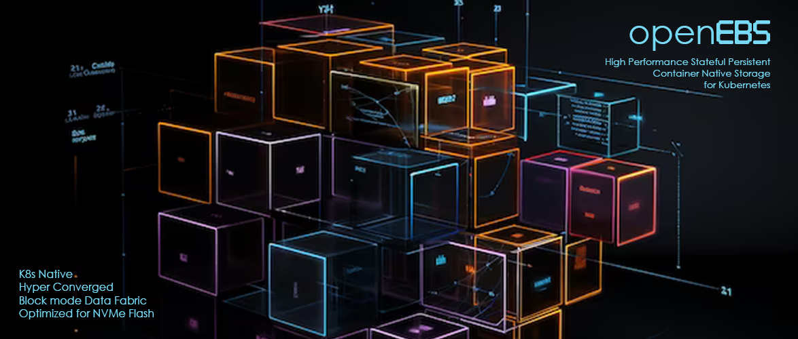

[evercoolhk-2024](https://dirkarnez.github.io/evercoolhk-2024)
==============================================================
### AHU Selection
- [dirkarnez/evercoolhk-2024-ahu-selection](https://github.com/dirkarnez/evercoolhk-2024-ahu-selection)

### Website update
- 
- [Webflow: Create a custom website | Visual website builder](https://webflow.com/?utm_source=bing&utm_medium=search&utm_campaign=SS-BingSearch-Brand-NetNewTest&utm_term=kwd-73255308069610:loc-200_webflow_e___&msclkid=ce3ddaa2fb5b1df27b2ebc87f99f19fb&utm_content=Webflow)
- [Dashkit - Dashboard HTML Template](https://dashkit.cssninja.io/)
- [UI Kits for Developers and Web Agencies - cssninja.io](https://cssninja.io/)
- [cssninjaStudio](https://github.com/cssninjaStudio)
- [Orbitor - Multipage Bulma Agency template](https://themefisher.com/products/orbitor-bulma)
- [Lux • Bulmaswatch - Free themes for Bulma - A modern CSS framework based on Flexbox](https://jenil.github.io/bulmaswatch/lux/)
- [Nuclear • Bulmaswatch - Free themes for Bulma - A modern CSS framework based on Flexbox](https://jenil.github.io/bulmaswatch/nuclear/)
- [Themes in Bulma | Bulma: Free, open source, and modern CSS framework based on Flexbox](https://bulma.io/documentation/features/themes/)
- [Webflow: Create a custom website | Visual website builder](https://webflow.com/)
- [Focus - Bootstrap Admin Dashboard](https://demo.themefisher.com/focus-bootstrap/chart-morris.html)
- [Focus - Admin Template](https://themefisher.com/products/focus-bootstrap)
- [Best Website Themes and Templates - Themefisher](https://themefisher.com/)
- [Biztrox - Multipage Bootstrap Business template](https://themefisher.com/products/biztrox-bootstrap)
- [Constra - Construction Template](https://themefisher.com/products/constra-bootstrap)
- [Constra - Construction Template](https://themefisher.com/products/constra-bootstrap)
- [Constra - Construction Template](https://themefisher.com/products/constra-bootstrap)
- [Themefisher](https://github.com/themefisher)
- [orbitor-bulma/theme at main · themefisher/orbitor-bulma · GitHub](https://github.com/themefisher/orbitor-bulma/tree/main/theme)
- [orbitor-bulma/source/images at main · themefisher/orbitor-bulma · GitHub](https://github.com/themefisher/orbitor-bulma/tree/main/source/images)
- [GitHub - themefisher/orbitor-bulma](https://github.com/themefisher/orbitor-bulma)
